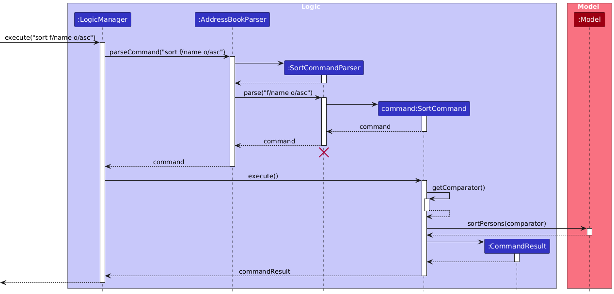
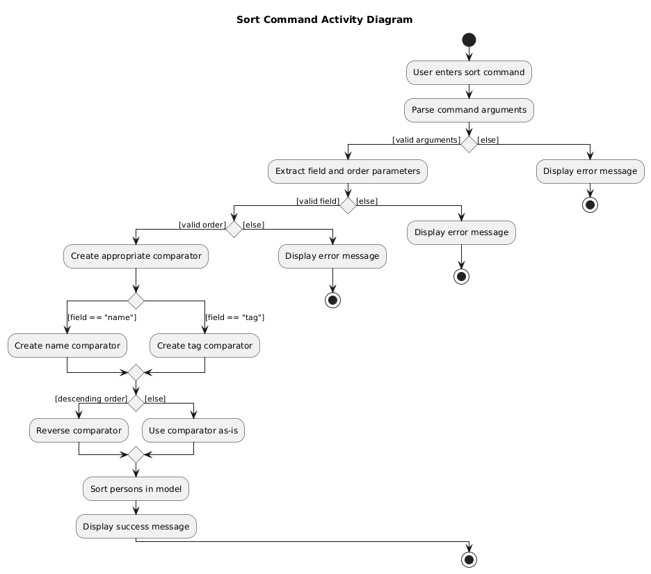
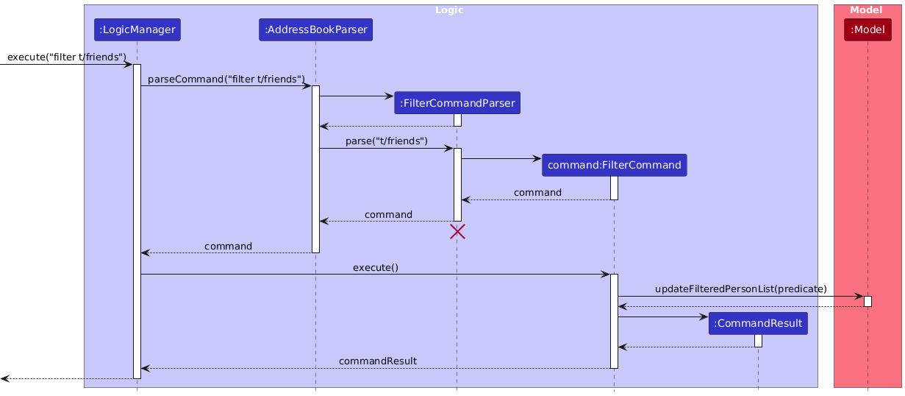
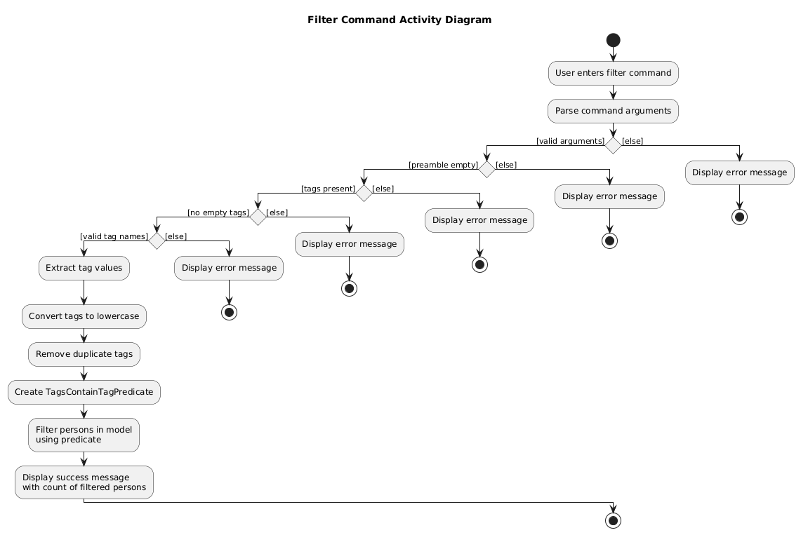

# FastCard Developer Guide

<!-- * Table of Contents -->
## **Table of Contents**

- [Acknowledgements](#acknowledgements)
- [Setting up, Getting started](#setting-up-getting-started)
- [Design](#design)
    - [Architecture](#architecture)
    - [UI Component](#ui-component)
    - [Logic Component](#logic-component)
    - [Model Component](#model-component)
    - [Storage Component](#storage-component)
    - [Common Classes](#common-classes)
- [Implementation](#implementation)
    - [Sort Feature](#sort-feature)
    - [Filter Feature](#filter-feature)
- [Documentation, Logging, Testing, Configuration, Devops](#documentation-logging-testing-configuration-dev-ops)
- [Appendix: Requirements](#appendix-requirements)
    - [Product Scope](#product-scope)
    - [User Stories](#user-stories)
    - [Use Cases](#use-cases)
    - [Non-Functional Requirements](#non-functional-requirements)
    - [Glossary](#glossary)
- [Appendix: Instructions for manual testing](#appendix-instructions-for-manual-testing)

<page-nav-print />

--------------------------------------------------------------------------------------------------------------------

## **Acknowledgements**

* This project is largely based on and a fork of the original [AB3 codebase](https://github.com/nus-cs2103-AY2526S1/tp)

* This documentation page was generated using [MarkBind](https://markbind.org/)

* Libraries used: [JavaFX](https://openjfx.io/), [Jackson](https://github.com/FasterXML/jackson), [JUnit5](https://github.com/junit-team/junit5)

--------------------------------------------------------------------------------------------------------------------

## **Setting up, getting started**

Refer to the guide [_Setting up and getting started_](SettingUp.md).

--------------------------------------------------------------------------------------------------------------------

## **Design**

### Architecture

<puml src="diagrams/ArchitectureDiagram.puml" width="280" />

The ***Architecture Diagram*** given above explains the high-level design of the App.

Given below is a quick overview of main components and how they interact with each other.

**Main components of the architecture**

**`Main`** (consisting of classes [`Main`](https://github.com/se-edu/addressbook-level3/tree/master/src/main/java/seedu/address/Main.java) and [`MainApp`](https://github.com/se-edu/addressbook-level3/tree/master/src/main/java/seedu/address/MainApp.java)) is in charge of the app launch and shut down.
* At app launch, it initializes the other components in the correct sequence, and connects them up with each other.
* At shut down, it shuts down the other components and invokes cleanup methods where necessary.

The bulk of the app's work is done by the following four components:

* [**`UI`**](#ui-component): The UI of the App.
* [**`Logic`**](#logic-component): The command executor.
* [**`Model`**](#model-component): Holds the data of the App in memory.
* [**`Storage`**](#storage-component): Reads data from, and writes data to, the hard disk.

[**`Commons`**](#common-classes) represents a collection of classes used by multiple other components.

**How the architecture components interact with each other**

The *Sequence Diagram* below shows how the components interact with each other for the scenario where the user issues the command `delete Alice Pauline`.

<puml src="diagrams/ArchitectureSequenceDiagram.puml" width="574" />

Each of the four main components (also shown in the diagram above),

* defines its *API* in an `interface` with the same name as the Component.
* implements its functionality using a concrete `{Component Name}Manager` class (which follows the corresponding API `interface` mentioned in the previous point.

For example, the `Logic` component defines its API in the `Logic.java` interface and implements its functionality using the `LogicManager.java` class which follows the `Logic` interface. Other components interact with a given component through its interface rather than the concrete class (reason: to prevent outside component's being coupled to the implementation of a component), as illustrated in the (partial) class diagram below.

<puml src="diagrams/ComponentManagers.puml" width="300" />

The sections below give more details of each component.

### UI component

The **API** of this component is specified in [`Ui.java`](https://github.com/se-edu/addressbook-level3/tree/master/src/main/java/seedu/address/ui/Ui.java)

<puml src="diagrams/UiClassDiagram.puml" alt="Structure of the UI Component"/>

The UI consists of a `MainWindow` that is made up of parts e.g.`CommandBox`, `ResultDisplay`, `PersonListPanel`, `StatusBarFooter` etc. All these, including the `MainWindow`, inherit from the abstract `UiPart` class which captures the commonalities between classes that represent parts of the visible GUI.

The `UI` component uses the JavaFx UI framework. The layout of these UI parts are defined in matching `.fxml` files that are in the `src/main/resources/view` folder. For example, the layout of the [`MainWindow`](https://github.com/se-edu/addressbook-level3/tree/master/src/main/java/seedu/address/ui/MainWindow.java) is specified in [`MainWindow.fxml`](https://github.com/se-edu/addressbook-level3/tree/master/src/main/resources/view/MainWindow.fxml)

The `UI` component,

* executes user commands using the `Logic` component.
* listens for changes to `Model` data so that the UI can be updated with the modified data.
* keeps a reference to the `Logic` component, because the `UI` relies on the `Logic` to execute commands.
* depends on some classes in the `Model` component, as it displays `Person` object residing in the `Model`.

### Logic component

**API** : [`Logic.java`](https://github.com/se-edu/addressbook-level3/tree/master/src/main/java/seedu/address/logic/Logic.java)

Here's a (partial) class diagram of the `Logic` component:

<puml src="diagrams/LogicClassDiagram.puml" width="550"/>

The sequence diagram below illustrates the interactions within the `Logic` component, taking `execute("delete Alice Pauline")` API call as an example.

<puml src="diagrams/DeleteSequenceDiagram.puml" alt="Interactions Inside the Logic Component for the `delete Alice Pauline` Command" />

<box type="info" seamless>

**Note:** The lifeline for `DeleteCommandParser` should end at the destroy marker (X) but due to a limitation of PlantUML, the lifeline continues till the end of diagram.
</box>

How the `Logic` component works:

1. When `Logic` is called upon to execute a command, it is passed to an `AddressBookParser` object which in turn creates a parser that matches the command (e.g., `DeleteCommandParser`) and uses it to parse the command.
1. This results in a `Command` object (more precisely, an object of one of its subclasses e.g., `DeleteCommand`) which is executed by the `LogicManager`.
1. The command can communicate with the `Model` when it is executed (e.g. to delete a person). 
   Note that although this is shown as a single step in the diagram above (for simplicity), in the code it can take several interactions (between the command object and the `Model`) to achieve.
1. The result of the command execution is encapsulated as a `CommandResult` object which is returned back from `Logic`.

Here are the other classes in `Logic` (omitted from the class diagram above) that are used for parsing a user command:

<puml src="diagrams/ParserClasses.puml" width="600"/>

How the parsing works:
* When called upon to parse a user command, the `AddressBookParser` class creates an `XYZCommandParser` (`XYZ` is a placeholder for the specific command name e.g., `AddCommandParser`) which uses the other classes shown above to parse the user command and create a `XYZCommand` object (e.g., `AddCommand`) which the `AddressBookParser` returns back as a `Command` object.
* All `XYZCommandParser` classes (e.g., `AddCommandParser`, `DeleteCommandParser`, ...) inherit from the `Parser` interface so that they can be treated similarly where possible e.g, during testing.

### Model component
**API** : [`Model.java`](https://github.com/se-edu/addressbook-level3/tree/master/src/main/java/seedu/address/model/Model.java)

<puml src="diagrams/ModelClassDiagram.puml" width="450" />

The `Model` component,

* stores the address book data i.e., all `Person` objects (which are contained in a `UniquePersonList` object).
* stores the currently 'selected' `Person` objects (e.g., results of a search query) as a separate _filtered_ list which is exposed to outsiders as an unmodifiable `ObservableList<Person>` that can be 'observed' e.g. the UI can be bound to this list so that the UI automatically updates when the data in the list change.
* stores a `UserPref` object that represents the user’s preferences. This is exposed to the outside as a `ReadOnlyUserPref` objects.
* stores a `CommandHistory` object that keeps track of the commands a user inputs during runtime. This is exposed to the outside as a `ReadOnlyCommandHistory` object.
* does not depend on any of the other three components (as the `Model` represents data entities of the domain, they should make sense on their own without depending on other components)

<box type="info" seamless>

**Note:** An alternative (arguably, a more OOP) model is given below. It has a `Tag` list in the `AddressBook`, which `Person` references. This allows `AddressBook` to only require one `Tag` object per unique tag, instead of each `Person` needing their own `Tag` objects. 

<puml src="diagrams/BetterModelClassDiagram.puml" width="450" />

</box>

### Storage component

**API** : [`Storage.java`](https://github.com/se-edu/addressbook-level3/tree/master/src/main/java/seedu/address/storage/Storage.java)

<puml src="diagrams/StorageClassDiagram.puml" width="550" />

The `Storage` component,
* can save both address book data and user preference data in JSON format, and read them back into corresponding objects.
* inherits from both `AddressBookStorage` and `UserPrefStorage`, which means it can be treated as either one (if only the functionality of only one is needed).
* depends on some classes in the `Model` component (because the `Storage` component's job is to save/retrieve objects that belong to the `Model`)

### Common classes

Classes used by multiple components are in the `seedu.address.commons` package.

--------------------------------------------------------------------------------------------------------------------

## **Implementation**

This section describes some noteworthy details on how certain features are implemented.

#### Sort Feature

Sorting is facilitated by `SortCommand` and `SortCommandParser`, following these steps:

1. **User input parsing**: `SortCommandParser#parse()` tokenizes the user input into an `ArgumentMultimap` containing the field and order values, then validates the tokens and creates a `SortCommand` object with the parsed parameters.

2. **Comparator Creation**: `SortCommand#execute()` calls `SortCommand#getComparator()` which creates the appropriate `Comparator<Person>` based on the specified field (name/tag) and order (ascending/descending).

3. **Model update**: `SortCommand` invokes `Model#sortPersons(comparator)` to trigger the sorting operation.

4. **Sorting execution**: The sort operation cascades through:
    * `Model#sortPersons(comparator)` &rarr; `AddressBook#sortPersons(comparator)` &rarr; `UniquePersonList#sortPersons(comparator)`

5. **Result**: A `CommandResult` is returned to display the success message to the user.

The sequence diagram below shows how the sort operation works:

The activity diagram below depicts the execution flow of the sort command:

#### Filter Feature
The filtering mechanism is facilitated by `FilterCommand` and `FilterCommandParser`, following these steps:

1. **User input parsing**: `FilterCommandParser#parse()` tokenizes the user input into an `ArgumentMultimap` containing tag values, then validates the tokens through `FilterCommandParser#checkValidTokens()`. The parser converts all tags to lowercase, removes duplicates, and creates a `TagsContainTagPredicate` object with the processed tags. A `FilterCommand` object is then instantiated with this predicate.

2. **Validation checks**: The parser performs several validations:
    * Ensures that at least one `PREFIX_TAG` token exists
    * Verifies no input exists between "filter" and the first prefix
    * Confirms no empty tags are present
    * Validates all tag names are alphanumeric

3. **Model update**: `FilterCommand#execute()` invokes `Model#updateFilteredPersonList(predicate)` to apply the filtering operation.

4. **Filtering execution**: The model updates its filtered person list by applying the `TagsContainTagPredicate`, which matches any person whose tags contain at least one of the specified tags (case-insensitive matching).

5. **Result**: A `CommandResult` is returned displaying the number of persons found matching the filter criteria.

The sequence diagram below shows how the filter operation works:

The activity diagram below depicts the execution flow of the filter command:

[To include implementations once finalised - with PUML]

--------------------------------------------------------------------------------------------------------------------

## **Documentation, logging, testing, configuration, dev-ops**

* [Documentation guide](Documentation.md)
* [Testing guide](Testing.md)
* [Logging guide](Logging.md)
* [Configuration guide](Configuration.md)
* [DevOps guide](DevOps.md)

--------------------------------------------------------------------------------------------------------------------

## **Appendix: Requirements**

### Product scope

**Target user profile**:

* regularly interact with clients or suppliers
* has a need to manage a significant number of contacts efficiently
* prefer desktop apps over other types
* can type fast
* prefers typing to mouse interactions
* is reasonably comfortable using CLI apps

**Value proposition**: Enable sales and procurement professionals engaged in regular business communication to efficiently capture, organize, and recall contact details in real time, minimizing information loss and improving follow-up accuracy.

### User stories

Priorities: High (must have) - `* * *`, Medium (nice to have) - `* *`, Low (unlikely to have) - `*`

| Priority | As a …​                           | I want to …​                                                              | So that I can…​                                                                          |
|----------|----------------------------------|--------------------------------------------------------------------------|-----------------------------------------------------------------------------------------|
| `* * *`  | sales / procurement professional | add a contact with just a name and phone number                          | not lose time during meetings and can fill in the details later when convenient         |
| `* * *`  | sales / procurement professional | record multiple contact methods when adding a new contact                | have multiple channels for communication                                                |
| `* * *`  | sales / procurement professional | assign category tags when I add new customers (e.g company)              | better manage different types of clients by knowing their industry                      |
| `* * *`  | sales / procurement professional | delete a contact in my address book                                      | remove contacts that are no longer a prospect                                           |
| `* * *`  | sales / procurement professional | list all contacts in my address book                                     | access all contact records to manage sales and procurement activities                   |
| `* * *`  | sales / procurement professional | sort my contacts based on a field (e.g name, contact number, etc)        | view relevant clients easily or rank clients easily                                     |
| `* * *`  | sales / procurement professional | filter my contacts based on each client's tags                           | quickly find relevant clients and manage my outreach more efficiently                   |
| `* * *`  | sales / procurement professional | access the application offline without internet                          | view and manage my contacts even without internet connectivity                          |
| `* * *`  | forgetful user                   | know if there is any contact with the same information or contact number | prevent any duplicate entries in my address book                                        |
| `* * *`  | forgetful user                   | be able to do a fuzzy search for customers                               | still find customers information even if I only remember part of the information        |
| `* *`    | lazy user                        | be able to edit an existing contact                                      | edit existing contact information directly, without removing and recreating the contact |
| `* *`    | careless user                    | navigate through my past commands                                        | reduce time spent retyping my previous commands in case of any mistakes                 |

*{More to be added}*

### Use cases

(For all use cases below, the **System** is the `FastCard` and the **Actor** is the `user`, unless specified otherwise)

**Use case: UC01 - Delete a contact**

**MSS**

1.  User requests to delete a contact by name.
2.  FastCard finds the contact with that name.
3.  FastCard deletes the contact.

    Use case ends.

**Extensions**

* 2a. More than one contact is found with that specific name.

    * 2a1. FastCard lists the matching contacts.
    * 2a2. User requests to delete one of the listed contacts by index.
    * 2a3. FastCard deletes the contact.

      Use case ends.

* 2b. No contact has the provided name.

    * 2b1. FastCard shows an error message.

      Use case resumes at step 1.

* 2c. The provided index does not exist in the displayed list.

    * 2c1. FastCard shows an error message.

      Use case resumes at step 1.

**Use case: UC02 - Add a contact**

**MSS**

1.  User requests to add a contact with name and phone number
2.  FastCard creates an entry of the above contact

    Use case ends.

**Extensions**

* 1a. The given number is invalid.

    * 1a1. FastCard shows an error message.

      Use case resumes at step 1.

* 1b. The given number already exists.

   *  1b1. FastCard shows an error message.

      Use case resumes at step 1.

**Use case: UC03 - Edit a contact's particulars**

**MSS**

1.  User requests to edit a contact's information
2.  FastCard looks for person with their phone number
3.  FastCard updates the person's particulars

    Use case ends.

**Extensions**

* 2a. The given number is invalid.

    * 2a1. FastCard shows an error message.

      Use case resumes at step 1.

* 3a. The new information is invalid.

    * 3a1. FastCard shows an error message.

      Use case resumes at step 1.

**Use case: UC04 - Sort contacts**

**MSS**
1.  User requests to sort contacts by a specific field and order.
2.  FastCard validates the field and order parameters
3.  FastCard sorts the contacts according to the specified criteria
4.  FastCard displays the sorted contact list with a success message

    Use case ends.

**Extensions**
   
  * 1a. User does not provide both field and order parameters.
    * 1a1. FastCard shows an error message.
      Use case resumes at step 1.

  * 1b. User provides input between "sort" and the first prefix.
    * 1b1. FastCard shows an error message.
      Use case resumes at step 1.

  * 1c. User provides duplicate prefixes.
    * 1c1. FastCard shows an error message.
      Use case resumes at step 1.

  * 2a. The provided field is invalid (not "name" or "tag").
    * 2a1. FastCard shows an error message.
      Use case resumes at step 1.

  * 2b. The provided order is invalid (not "asc", "desc", "ascending", or "descending").
    * 2b1. FastCard shows an error message.
    Use case resumes at step 1.

**Use case UC05 - Filter contacts by tags**

**MSS**
1.  User requests to filter contacts by one or more tags
2.  FastCard validates the tag parameters.
3.  FastCard filters the contacts to show only those containing any of the specified tags.
4.  FastCard displays the filtered contact list with the count of matching contacts.

    Use case ends.

**Extensions**

  * 1a. User does not provide any tag parameters.
    * 1a1. FastCard shows an error message.
      Use case resumes at step 1.

  * 1b. User provides input between "filter" and the first tag prefix.
    * 1b1. FastCard shows an error message.
      Use case resumes at step 1.

  * 2a. One or more tags are empty.
    * 2b1. FastCard shows an error message.
      Use case resumes at step 1.
  
  * 2b. One or more tags contain non-alphanumeric characters
    * 2b1. FastCard shows an error message.
      Use case resumes at step 1.

  * 3a. No contacts match the specified tags.
    * 3a1. FastCard displays an empty list with a count of 0 persons.
    Use case ends.

*{More to be added}*

### Non-Functional Requirements

1.  Should work on any _mainstream OS_ as long as it has Java `17` or above installed.
2.  Should be able to hold up to 1000 persons without a noticeable sluggishness in performance for typical usage.
3.  A user with above average typing speed for regular English text (i.e. not code, not system admin commands) should be able to accomplish most of the tasks faster using commands than using the mouse.
4.  Should work offline without a need for an external database server.
5.  Data should be stored in a human editable text file to allow advanced users to manipulate the data directly through the data file.
6.  Should be portable without the need for an installer.
7.  System must ensure that long term data is not lost unexpectedly, even in cases of abrupt shutdowns or crashes
8.  Automated Testing should cover all core functionality implementations
9.  Error messages should be prominent and usually provide specific information regarding the issue

### Glossary

* **FastCard**: The product name of this application.
* **Contact (Person)**: An entity representing a business contact with name, phone, email, address, and tags.
* **Tag**: A short label attached to a contact for categorization (e.g., client, supplier, industry).
* **Command**: A text instruction entered by the user in the command box (e.g., `add`, `edit`, `find`, `list`, `delete`, `clear`, `help`, `exit`).
* **Index**: A 1-based position of a contact within the currently displayed list.
* **Duplicate contact**: A contact that conflicts with an existing one based on identity fields (e.g., same phone number).
* **Address Book**: The collection of contacts managed by FastCard.
* **GUI (Graphical User Interface)**: The JavaFX-based visual interface (e.g., `MainWindow`, `PersonListPanel`).
* **CLI (Command Line Interface)**: Text-based interaction via the command input box.
* **Model**: Holds in-memory application data and preferences; exposes a filtered, observable list of contacts.
* **Logic**: Parses commands and executes them against the `Model`, returning a `CommandResult`.
* **Storage**: Persists and retrieves data (address book and user prefs) from JSON files.
* **User preferences**: Settings such as window size and file paths (read-only view exposed as `ReadOnlyUserPref`).
* **ObservableList**: A JavaFX list implementation that notifies the UI of changes.
* **UniquePersonList**: An internal list that enforces uniqueness for contacts.
* **Parser / XYZCommandParser**: Classes that convert user input into executable command objects.
* **CommandResult**: The outcome of executing a command, including the feedback message shown to the user.
* **Undo/Redo**: Feature that reverts or reapplies recent changes to the address book using stored history.
* **MSS (Main Success Scenario)**: The primary, exception-free flow of a use case.
* **NFR (Non-Functional Requirement)**: A quality constraint on the system (e.g., performance, portability).
* **Actor**: The user interacting with FastCard in use cases.
* **System**: The application under discussion in use cases (i.e., FastCard).
* **JSON**: Data format used for persistence (e.g., `data/addressbook.json`).
* **Sample data**: Default contacts provided on first launch to demonstrate core features.
* **Mainstream OS**: Windows, Linux, Unix, MacOS
* **Private contact detail**: A contact detail that is not meant to be shared with others
* **Home folder**: The directory where the FastCard `.jar` resides; used as the base for `data/` and `preferences.json`.
* **Data file**: The JSON file at `data/addressbook.json` storing contacts and tags.
* **Filtered list**: The subset of contacts currently matching a search or filter, shown in the UI and backed by the model's observable list.
* **Primary identifier**: The field(s) used to check contact identity (e.g., phone number) to prevent duplicates.
* **Prefix**: The short marker preceding a field in a command (e.g., `n/`, `p/`, `e/`, `a/`, `t/`).
* **Command box**: The text input field where users type commands.
* **Result display**: The UI area showing the outcome messages of executed commands.
* **Status bar**: The UI footer indicating summaries such as list counts and last update time.
* **Person card**: The UI element representing a single contact in the list.
* **Help window**: A separate window displaying usage instructions, opened via the `help` command.

--------------------------------------------------------------------------------------------------------------------

## **Appendix: Instructions for manual testing**

Given below are instructions to test the app manually.

<box type="info" seamless>

**Note:** These instructions only provide a starting point for testers to work on;
testers are expected to do more *exploratory* testing.

</box>

### Launch and shutdown

1.  Initial launch

    1.  Download the jar file and copy into an empty folder

    1.  Double-click the jar file Expected: Shows the GUI with a set of sample contacts. The window size may not be optimum.

1.  Saving window preferences

   1.  Resize the window to an optimum size. Move the window to a different location. Close the window.

   1.  Re-launch the app by double-clicking the jar file. 
       Expected: The most recent window size and location is retained.

1. _{ more test cases …​ }_

### Deleting a person

1.  Deleting a person while all persons are being shown

    1.  Prerequisites: List all persons using the `list` command. Multiple persons in the list.

    1.  Test case: `delete Alice Pauline` 
        Expected: The contact named `Alice Pauline` is deleted when she is the only contact with that name. Details of the deleted contact shown in the status message. Timestamp in the status bar is updated.

    1.  Test case: 'delete 1' 
        Expected: First contact in the currently displayed list is deleted. Details of the deleted contact shown in the status message. Timestamp in the status bar is updated.

    1.  Test case: `delete 0` 
        Expected: No person is deleted. Error details shown in the status message. Status bar remains the same.

    1.  Test case: `delete Jadon Ye` when multiple Jadons exist 
        Expected: No contact is deleted. FastCard lists the matching contacts so that the user can delete the intended one by index.

    1.  Other incorrect delete commands to try: `delete`, `delete x`, `delete Unknown Person`, `...` (where x is larger than the list size)       Expected: Similar to previous.

1. _{ more test cases …​ }_

### Sorting contacts

1.  Sorting contacts by name

    1.  Prerequisites: Multiple contacts in the address book with different names.

    1.  Test case: `sort f/name o/asc` 
        Expected: Contacts are sorted alphabetically by name in ascending order. Success message shows "Sorted all persons by name in ascending order".

    1.  Test case: `sort f/name o/desc` 
        Expected: Contacts are sorted alphabetically by name in descending order. Success message shows "Sorted all persons by name in descending order".

    1.  Test case: `sort f/name o/ascending` 
        Expected: Same as `sort f/name o/asc`.

    1.  Test case: `sort f/name o/descending` 
        Expected: Same as `sort f/name o/desc`.

2. Sorting contacts by tag

    2.  Prerequisites: Multiple contacts in the address book with different tags.

    2.  Test case: `sort f/tag o/asc` 
        Expected: Contacts are sorted by their first tag alphabetically (case-insensitive) in ascending order. Contacts without tags appear first.

    2.  Test case: `sort f/tag o/desc` 
        Expected: Contacts are sorted by their first tag alphabetically in descending order.

3. Invalid sort commands

    3.  Test case: `sort f/name` 
        Expected: No sorting occurs. Error message shows invalid command format.

    3.  Test case: `sort f/phone o/asc` 
        Expected: No sorting occurs. Error message shows invalid command format.

    3.  Test case: `sort f/name o/random` 
        Expected: No sorting occurs. Error message shows invalid command format.

    3.  Test case: `sort f/name o/asc f/tag` 
        Expected: No sorting occurs. Error message shows duplicate prefixes are not allowed.

    3.  Test case: `sort random f/name o/asc` 
        Expected: No sorting occurs. Error message shows invalid command format.

### Filtering contacts by tags
1. Filtering contacts with single tag
   
    1.  Prerequisites: Multiple contacts in the address book, some with the tag "friends", some without.

    1.  Test case: `filter t/friends` 
        Expected: Only contacts with the "friends" tag are displayed. Status message shows the number of persons listed (e.g., "3 persons listed!").

    1.  Test case: `filter t/FRIENDS` 
        Expected: Same as above. Tag matching is case-insensitive.

    1.  Test case: `filter t/colleagues` 
        Expected: Only contacts with the "colleague" tag are displayed.
    
2. Filtering contacts with multiple tags

    2.  Prerequisites: Multiple contacts with various tags (e.g., "friends", "family", "colleagues").

    2.  Test case: `filter t/friends t/family` 
        Expected: Contacts with either "friends" OR "family" tags are displayed. Shows count of all matching contacts.

    2.  Test case: `filter t/friends t/friends t/family` 
        Expected: Same as above. Duplicate tags are automatically removed.

3. Filtering with no matches
  
    3.  Prerequisites: No contacts have the tag "nonexistent".

    3.  Test case: `filter t/nonexistent` 
        Expected: Empty list is displayed. Status message shows "0 persons listed!".

4. Invalid filter commands

    4.  Test case: `filter` 
        Expected: No filtering occurs. Error message shows invalid command format with usage instructions.

    4.  Test case: `filter friends` 
        Expected: Same as above.

    4.  Test case: `filter t/` 
        Expected: Same as above.

5. Clearing the filter

    5.  Test case: `list`
        Expected: All contacts are displayed again, removing the filter.

### Saving data

1. Dealing with missing/corrupted data files

   1. _{explain how to simulate a missing/corrupted file, and the expected behavior}_

1. _{ more test cases …​ }_
