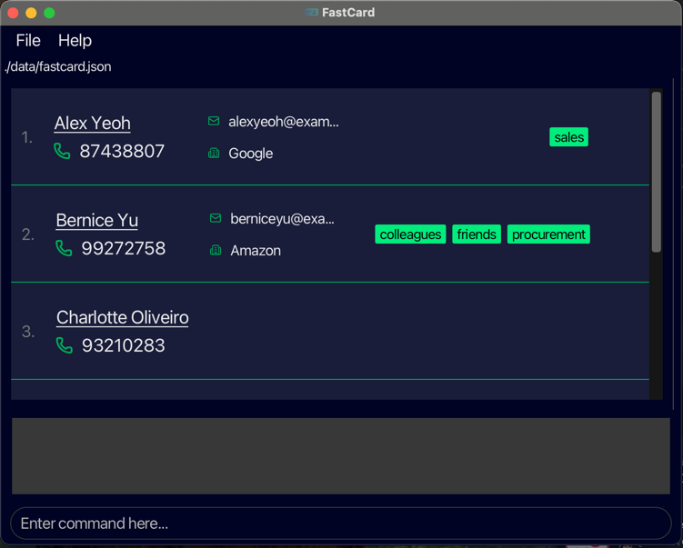

# FastCard User Guide
FastCard is a speed-focused contact manager for sales and procurement professionals who type faster than they click. Instead of navigating through menus, you type simple commands to add, find and manage your network in seconds. Pure Speed!

**Key Benefits:**
- ⚡ 3x faster than traditional contact managers
- 🎯 Find anyone instantly with keyword search
- 🏷️ Organize with tags for quick filtering
- 💾 Auto-saves every change - never lose data
- 🔒 100% offline - your data stays on your computer

## Who Should Use FastCard?

**Ideal for:**
- Sales professionals managing 100+ client relationships
- Procurement specialists tracking vendor contacts
- Business development teams building professional networks
- Anyone who types faster than they click through menus

**What you need to know:**
- **Basic computer skills** - Can open terminal/command prompt
- **Comfortable with keyboard** - Typing commands is faster for you than clicking
- **Desktop-based work** - FastCard runs on Windows, Mac, or Linux computers
- **No programming required** - Commands are simple English words

**Not suitable for:**
- Teams needing shared databases (single-user application)
- Users who strongly prefer graphical interfaces over typing

<!-- * Table of Contents -->
## **Quick Navigation**

**🚀 New to FastCard?**
- [Installation & Setup](#getting-started-with-fastcard)

**📚 Core Features**
- [Features](#features)
  - [Help Command](#getting-help--help)
  - [List Command](#viewing-all-contacts--list)
  - [AddBasic Command](#adding-a-contact-quickly-addbasic)
  - [Add Command](#adding-a-contact-with-complete-details--add)
  - [Edit Command](#updating-contact-information-edit)
  - [Find Command](#searching-for-contacts-by-name-find)
  - [Filter Command](#filtering-contacts-filter)
  - [Sort Command](#organizing-contacts-alphabetically-sort)
  - [Delete Command](#removing-a-contact--delete)
  - [Command Recall](#recalling-previous-commands---command-history)
  - [Clear Command](#removing-all-contacts--clear)
  - [Exit Command](#closing-fastcard--exit)
- [Saving Data](#saving-data)

**🔧 Advanced**
- [Editing Data File](#editing-the-data-file)

**❓ Help**
- [Frequently Asked Questions](#faq)
- [Known Issues](#known-issues)
- [Command Summary](#command-summary)

<page-nav-print />

--------------------------------------------------------------------------------------------------------------------

## Getting Started with FastCard

**Step 1: Install Java (if you haven't already)** <br>
FastCard requires **Java 17 or newer** to run. Java is free software that lets your computer run applications like FastCard.

**Check if you already have Java:**
1. Open your command terminal (Command Prompt on Windows, Terminal on Mac/Linux).
2. Type `java -version` and press Enter.
3. If you see "version 17" or higher, you're ready. Skip to Step 2.
4. If you see an error or a lower version number, install Java:
    * **Windows users:** Download Java 17 from [here](https://se-education.org/guides/tutorials/javaInstallationWindows.html#java-17-installation-guide-for-windows-users).
    * **Linux users:** Download Java 17 from [here](https://se-education.org/guides/tutorials/javaInstallationLinux.html#java-17-installation-guide-for-linux-users).
    * **Mac users:** Download Java 17 from [here](https://se-education.org/guides/tutorials/javaInstallationMac.html#java-17-installation-guide-for-mac-users).

**Step 2: Download FastCard**
1. Go to the FastCard releases page [here](https://github.com/AY2526S1-CS2103T-F11-4/tp/releases).
2. Download the latest `fastcard.jar` file (look for the newest version at the top).
3. Save it somewhere easy to find (like your Desktop or Documents folder).

**Step 3: Set up your FastCard folder**
1. Create a new folder where you want to keep FastCard and all your contact data.
    * Example: Create a folder called "FastCard" in your Documents.
2. Move the `fastcard.jar` file into this folder.
3. Remember this location. This is where all your data will be saved.

**Step 4: Launch FastCard**
**Using the command terminal:**
1. Open your command terminal:
    * **Windows:** Search for "Command Prompt" or "PowerShell"
    * **Mac:** Search for "Terminal" in Spotlight
    * **Linux:** Open your terminal application
2. Navigate to your FastCard folder by typing: `cd path/to/your/FastCard/folder` <br>
    * Example: `cd Documents/FastCard`
3. Run FastCard by typing: `java -jar fastcard.jar`
4. Press Enter

**What you should see:** FastCard's window should appear within a few seconds, showing some sample contacts to help you get started.



The window shows:
- Contact list (showing sample contacts)
- Result display area (showing command feedback)
- Command box (where you type commands)

**Troubleshooting:**
  * If you see "java is not recognized" &rarr; Java isn't installed correctly. Return to Step 1
  * If you see "file not found" &rarr; You're not in the right folder. Check Step 4 Point 2.

**Step 5: Try your first commands**
Type a command in the command box and press **Enter** to execute it.

**Try these example commands:**
1. See all contacts: `list`
2. Add a new contact: `add n/John Doe p/98765432 e/johnd@example.com c/Shopee`
3. Search for a contact: `find John`
4. Delete a contact: `delete John Doe`
5. Get help: `help`

**Step 6: Learn more commands**
Once you're comfortable with the basics, check out the [Features](#features) section below for the complete list of what FastCard can do.

--------------------------------------------------------------------------------------------------------------------

## Features

<box type="info" seamless>

**Notes about the command format:**<br>

**WORDS IN CAPITALS = Replace with your information**
* Commands show placeholders in `UPPER_CASE` that you need to replace with actual information.<br>
  Example: In `add n/NAME`, `NAME` can be replaced with `John Doe`, resulting in `add n/John Doe`.

**[Square Brackets] = Optional**
* Anything in square brackets is optional. You can include it or skip it.<br>
  Example: `n/NAME [t/TAG]` means:
    * `n/John Doe t/client` (with optional tag)
    * `n/John Doe` (without tag, still works!)

**Three Dots… = Repeat as needed**
* Items with `…` can be used multiple times or not at all.<br>
  Example: `[t/TAG]…​` means:
    * ` ` (no tags)
    * `t/client` (one tag)
    * `t/client t/highPriority t/hotLead` (multiple tags, add as many as you want!)

**Order Doesn't Matter**
* You can type the information in any order that makes sense to you.<br>
  Example: These commands do the exact same thing:
    * `addbasic n/John Doe p/91234567`
    * `addbasic p/91234567 n/John Doe`

**Extra Words Get Ignored**
* For simple commands like `help`, `list`, `exit`, and `clear`, anything extra you type will be ignored.<br>
  Example: Typing `help 123` or `help please` both just run `help`.

If you're reading this as a PDF and copying commands, be aware that spaces may get removed when you paste them into FastCard. This can cause commands to fail.

**Solution:** After pasting, check that spaces are still there, especially around line breaks.
</box>

### Getting help : `help`

Opens a help window with a link to the complete user guide.

**Format:** `help`

**What you need to know:**
  * Opens a popup window with help information
  * You can close the window to return to FastCard
  * You can also press `F1` as a keyboard shortcut

**When to use this:**
  * You forgot how a command works
  * You want to see all available commands
  * You need detailed examples or explanations
  * You're learning FastCard for the first time

**Example: Opening help window**
```
help
```
**You'll see:**
  * A popup window appears with the help message
  * The window displays "Refer to the user guide:..."
  * You can click `Browse` or `Copy URL` to access the complete user guide or to copy the URL respectively.

**In the main window:**
  * FastCard remains open in the background
  * You can continue using FastCard after closing the help window

&rarr; Quick access to full documentation when you need guidance

<box type="tip" seamless>

💡 Pro Tips:
  * **Use `F1` shortcut** - Press `F1` on your keyboard for instant help access without typing
  * **Keep guide bookmarked** - Save the user guide URL in your browser for quick reference
  * **Check before experimenting** - Review command formats in the guide before trying new commands

</box>

### Viewing all contacts : `list`

Shows your complete contact list, displaying everyone in FastCard.

**Format:** `list`

**What you need to know:**
  * Removes any active filters or searches

**When to use this:**
  * After you use `find` or `filter` to return to full view
  * You want to see all of contacts
  * To start fresh before a new search or filter

**Example: Viewing all contacts:**
```
list
```
**You'll see:**
```
Listed all persons
```
**In the contact list:**
  * All contacts reappear (any previous filters are removed)

&rarr; Use this as your "reset" command to see everyone after any operation

<box type="tip" seamless>

💡 Pro Tips:
  * **Your reset button** - Think of `list` as your "show everything" reset whenever you're narrowed down
  * **Before filtering** - Run `list` first to ensure you're starting with everyone visible
  * **After accidental filter** - If you filtered by mistake and can't find contacts, `list` brings everyone back

</box>

**Common mistakes:**
  * Expecting `list` to show filtered results &rarr; It shows **ALL** contacts (removes filters)
  * Thinking contacts are deleted when filtered &rarr; They're just hidden; `list` reveals them all

### Adding a contact quickly: `addbasic`

Quickly saves a contact with just their name and phone number - perfect when you meet someone and want to add details later.

**Format:** `addbasic n/NAME p/PHONE`

**What you need to provide:**
  * **Name** (`n/`) - Full name (letters, numbers and spaces only)
  * **Phone** (`p/`) - At least 3 digits

**What you need to know:**
  * The combination of name **AND** phone number must be unique, you can't add two people with the same name and phone number combination
  * You can add more details later using the `edit` command

**When to use this:**
  * Quick entry during networking events or meetings
  * You only have basic contact information right now
  * Need to capture name and number fast, will add details later
  * Building a contact list from business cards

**Use `add` instead if:** You have complete information (email, company, tags) ready to enter.

**Examples:**

**Example 1: Quick add during a meeting**
```
addbasic n/Sarah Chen p/98765432
```
**You'll see:**
```
You have successfully added this contact:
Name: Sarah Chen
Phone: 98765432
```
**In the contact list:**
  * Sarah Chen appears with her phone number
  * Other fields (email, company, tags) are empty until you add them

&rarr; Adds Sarah Chen immediately. Later, use `edit Sarah Chen e/sarah@example.com c/Shopee` to complete her profile.

**Example 2: Adding multiple contacts quickly (one at a time)**
```
addbasic n/Mike Wong p/91112222
addbasic n/Lisa Kumar p/93334444
addbasic n/David Tan p/95556666
```
**You'll see:**
  * Similar to above

&rarr; Adds three contacts in seconds. Fill in details later when you have time.

<box type="tip" seamless>

💡 Pro Tip: Use `addbasic` during conversations or events to capture contacts immediately. Update with full details later using the `edit` command when you're back at your desk.

</box>

**Common mistakes:**
  * `addbasic n/Alice Tan` &rarr; Missing phone number (both name AND phone are required)
  * `addbasic Alice Tan 91234567` &rarr; Missing prefixes (need `n/` and `p/`)

### **Adding a contact with complete details** : `add`

Adds a contact with full information including name, phone, email, company, and optional tags.

**Format:** `add n/NAME p/PHONE e/EMAIL c/COMPANY [t/TAG]…`

**What you need to provide:**
  * **Name** (`n/`) - Full name (letters, numbers, and spaces only)
  * **Phone** (`p/`) - At least 3 digits
  * **Email** (`e/`) - Valid email address (e.g., name@company.com)
  * **Company** (`c/`) - Company or organization name
  * **Tags** (`t/`) - Optional labels like "client", "colleague" or "vendor" (add as many as you want)

**What you need to know:**
  * The combination of name **AND** phone number must be unique (similar to `addbasic`)
  * All fields except tags are required
  * Add multiple tags by repeating `t/` (e.g., `t/client t/priority`)

**When to use this:**
  * You have all contact information ready to enter.
  * You want to organize contacts with tags immediately.
  * You're adding professional contacts that need full details.

**Use `addbasic` instead if:** You only have a name and phone number right now.

**Examples:**

**Example 1: Adding a client with multiple tags**
```
add n/Sarah Chen p/98765432 e/sarahchen@example.com c/Shopee t/client t/priority t/tech
```
**You'll see:**
```
New person added:
Name: Sarah Chen
Phone: 98765432
Email: sarahchen@example.com
Company: Shopee
Tags: [tech] [client] [priority]
```
**In the contact list:**
  * Sarah Chen appears with all details displayed
  * Tags are shown as colored labels next to the contact
  * Contact is added to the bottom of the current list

&rarr; Adds Sarah Chen with email, company, and three organizational tags for easy filtering

**Example 2: Adding a colleague without tags**
```
add n/Mike Kumar p/87654321 e/mike@company.com c/ABC Industries
```
**You'll see:**
  * Similar to above

&rarr; Adds Mike Kumar with all required details. Tags can be added later using `edit`

<box type="tip" seamless>

💡 Pro Tip:
  * **Create a tagging system** - Use consistent tags like `client`, `vendor`, `colleague`, `priority` across all contacts. This allows you to filter and find contacts quickly!

</box>

**Common Mistakes:**
  * `add n/John Doe p/91234567 e/john@example.com` &rarr; Forgetting to include all required fields (name, phone, email, company)
  * `add n/John Doe p/91234567 e/john@ c/Shopee` &rarr; Incomplete email address (missing domain)
  * `add John Doe 91234567 john@email.com Shopee` &rarr; Missing prefixes (need `n/`, `p/`, `e/`, `c/`)
  * `add n/John Doe p/91234567 e/john@example.com c/Shopee t/friend, colleague` &rarr; Don't use commas between tags (repeat `t/` instead)

### Updating contact information: `edit`

Updates an existing contact's information by either their name or position number in the list.

**Format:**
- `edit INDEX [n/NAME] [p/PHONE] [e/EMAIL] [c/COMPANY] [t/TAG]…​`
- `edit NAME  [n/NAME] [p/PHONE] [e/EMAIL] [c/COMPANY] [t/TAG]…​`

**What you need to provide:**
  * **Target contact** - Either the contact's `NAME` or their `INDEX` (position number in the displayed list)
  * **At least one field to update** - Any combination of name, phone, email, company, or tags
  * All fields are optional, but you must provide at least one

**What you need to know:**
  * **Edit by index** - Use the number shown next to the contact (must be 1, 2, 3, etc.)
  * **Edit by name** - Name matching is case-insensitive (`john doe` = `John Doe`)
  * **Full Name Required** - If editing by name, you need to provide the contact's full name (e.g., `edit Sarah` will not edit `Sarah Chen`'s contact)
  * **Multiple contacts with the same name** - FastCard will show all matches and ask you to edit by index instead
  * **Existing values are replaced** - Your new input completely replaces the old information

**When to use this:**
  * You want to update outdated phone numbers or email addresses
  * You want to add company information to contacts added with `addbasic`
  * You need to correct typos in contact details
  * You want to add or change tags for better organization

<box type="warning" seamless>

**⚠️ Important: Tag Replacement Behavior**

When you edit tags, ALL existing tags are **replaced** with your new tags - they don't add to existing ones.

**Example:**
  * Current tags: `[client][priority]`
  * You run: `edit John t/vendor`
  * New tags: `[vendor]` (`client` and `priority` tags are gone)

**To keep existing tags:** View them first with `list` or `find`, then include all tags you want to keep in your edit command.

**To remove all tags:** Use `t/` with nothing after it: `edit John t/`

</box>

**Examples:**

**Example 1: Adding details to a basic contact (unique match)**
```
edit Alice Tan e/alice@example.com c/Shopee t/client
```
**You'll see:**
```
Edited Person:
Name: Alice Tan
Phone: 91234567
Email: alice@example.com
Company: Shopee
Tags: [client]
```
**In the contact list:**
  * Alice Tan's email, company and tags are updated
  * Other fields (name, phone) remain unchanged
 
&rarr; Adds email, company, and tags to Alice who was previously added with just name and phone

**Example 2: Edit by name (multiple matches)**
```
edit John Doe e/johndoe@company.com
```
**If multiple John Doe exist, you'll see:**
```
There are multiple contacts’ names matched with the reference.
Please use the edit INDEX command to specify the contact you want to edit in the following list of matched contacts.
```
**In the contact list:**
  * Will only show contacts with the name `John Doe`

**Then run:** `edit 2 e/johndoe@company.com` to edit the specific John Doe

&rarr; Updates information of a specific John Doe contact

<box type="tip" seamless>

💡 Pro Tip: After editing, use `find` to confirm your updates were applied correctly

</box>

**Common Mistakes:**
  * `edit John Doe` &rarr; No fields provided (you must include at least one field to update)
  * `edit 0 p/91234567` &rarr; Invalid index (index starts at 1, not 0)

### Searching for contacts by name: `find`

Quickly finds contacts whose names include the words you're looking for.

**Format:** `find KEYWORD [MORE_KEYWORDS]`

**What you need to provide:**
  * **One or more keywords** - Words that appear in the contact's name

**What you need to know:**
  * Only searches **names** (not phone numbers, emails, companies or tags)
  * Not case-sensitive - `john`, `John`, and `JOHN` all find the same contacts
  * Word order doesn't matter - `find Bo Hans` and `find Hans Bo` give identical results
  * Must match **complete words** - `Han` won't find `Hans` (you need the full word)
  * Matches **any** keyword - If you search multiple words, contacts with ANY of those words will appear

**When to use this:**
  * You remember part of someone's name but not their full details
  * You want to quickly pull up one person from a large contact list
  * You're looking for several people at once (by searching multiple names)
  * You need to verify if someone is already in your contacts before adding them

**Examples:**

**Example 1: Finding a specific person**
```
find Sarah
```
**You'll see (depending on the number of contacts containing Sarah in their full name):**
```
2 persons listed!
```
**In the contact list:**
  * Only contacts with "Sarah" in their name are displayed.
  
&rarr; Shows all contacts with "Sarah" in their name (Sarah Chen, Sarah Kumar, etc.)

**Example 2: Finding multiple people for a meeting**
```
find John Mike Sarah
```
**You'll see:**
  * Similar to above

&rarr; Shows everyone with "John" OR "Mike" OR "Sarah" in their name - useful for preparing a meeting attendee list

<box type="tip" seamless>

💡 Pro Tips:
  * **Return to full list** - Use `list` after searching to see all contacts again
  * **Narrow your search** - Use fewer, more specific keywords for better results
  * **Search by tags instead** - If you're looking by tags, use `filter` instead

</box>

**Common mistakes:**
  * `find Han` expecting to find "Hans" &rarr; Partial words don't match (must be complete: `find Hans`)

### Filtering contacts: `filter`

Shows only contacts that have specific tags - perfect for viewing contacts by category like "client", "vendor", or "priority".

**Format:** `filter t/TAG [t/TAG]…`

**What you need to provide:**
  * **At least one tag** - The tag name you want to filter by (e.g., `client` or `vendor`)
  * **Multiple tags (optional)** - Add more tags to broaden your search

**What you need to know:**
  * You must specify at least one tag
  * You can specify more than one tag
    * Contacts with **any** of those tags will appear (not all tags required)
    * Specifying the same tag multiple times will be treated as it being specified once
  * Tags are not case-sensitive (`t/client` = `t/CLIENT`)
  * You should only specify tags (specifying other parameters is invalid e.g., `filter t/colleague n/John`)
  * You may list the tags in any order.
  * The exact tag name must match (e.g., `client` won't find contacts tagged with `clients`)
  * Tags specified must be alphanumeric and at most 30 characters
  * Leading and trailing whitespaces are trimmed
  * If no contacts contain any of the specified tags, an empty contact list will be shown
  * The global contact list shown by `list` command will be filtered, and not the currently displayed contact list
  * If no contacts match the specified tags, an empty contact list is shown

**When to use this:**
  * You want to view all contacts in a specific category (all clients, all vendors, etc.)
  * You want to prepare for meetings by filtering relevant contacts
  * You need to quickly access frequently-contacted groups

**Examples:**

**Example 1: View all clients**
```
filter t/client
```
**You'll see (depending on the number of contacts with the client tag):**
```
3 persons listed!
```
**In the contact list:**
  * Only contacts tagged with "client" are displayed

&rarr; Shows only contacts tagged as "client" - perfect before a client review meeting

**Example 2: View multiple business categories**
```
filter t/client t/vendor t/partner
```
**You'll see:**
  * Similar to above

&rarr; Shows anyone tagged as client, vendor, OR partner - useful for business contact overview

<box type="tip" seamless>

💡 Pro Tips:
  * **Return to full list** - Use `list` after searching to see all contacts again
  * **Search by name instead** - If you're looking by name, use `find` instead

</box>

**Common mistakes:**
  * `filter client` &rarr; Missing `t/` prefix (need `filter t/client`)
  * `filter t/` &rarr; Empty tag (must provide at least one tag name)

### Organizing contacts alphabetically: `sort`

Arranges your contacts in alphabetical order based on the field you choose - useful for organizing your list.

**Format:** `sort f/FIELD o/ORDER`

**What you need to provide:**
  * **Field** (`f/`) - What to sort by: `name` or `tag`
  * **Order** (`o/`) - Direction: `asc` (ascending/A-Z) or `desc` (descending/Z-A)

**Available fields:**
  * `name` - Sort by contact name
  * `tag` - Sort by the first tag alphabetically (e.g., If a contact has tags `vendor` and `priority`, the `priority` tag will be used for sorting by tag as it is the first tag in alphabetical order)

**Available orders:**
  * `asc` or `ascending` - 0 to 9 followed by A to Z order
  * `desc` or `descending` - Z to A followed by 9 to 0 order

**What you need to know:**
  * You should specify both field and order only (Specifying other parameters is invalid)
  * You should only specify one field and one order
  * Field and order are not case-sensitive. (`NAME = name`, `ASC` = `asc`)
  * Contacts without the sorted field appear at the start (for ascending order) or end (for descending order)
  * Leading and trailing whitespaces are trimmed
  * Sorting permanently reorders your contacts (Reloading FastCard will preserve the ordering of the contacts you sorted)
  * If multiple contacts contain the same field to be sorted by (ignoring case-sensitivity), the relative ordering of these contacts will be the same as the relative ordering before sorting.

<box type="warning" seamless>

The `sort` command works on the overall contact list and not just a filtered list from `find` or `filter`.

</box>

**When to use this:**
  * You want to organize your contact list for easier scanning
  * You need to prepare alphabetically ordered lists for meetings or reports
  * You want to group contacts by tag categories

**Examples:**

**Example 1: Alphabetize all contacts**
```
sort f/name o/asc
```
**You'll see:**
```
Sorted all persons by name in ascending order
```
**In the contact list:**
  * Contacts are now alphabetically ordered A&rarr;Z by name

&rarr; Orders everyone A&rarr;Z by name - perfect for quickly locating someone in a long list

**Example 2: Reverse alphabetical order**
```
sort f/name o/desc
```
**You'll see:**
  * Similar to above

&rarr; Orders everyone Z&rarr;A by name

<box type="tip" seamless>

💡 Pro Tip:
  * **Check tag organization** - Use `sort f/tag o/asc` to see how well your tagging system groups contacts

</box>

**Common mistakes:**
  * `sort f/name` &rarr; Missing order (must provide both field **AND** order)
  * `sort o/asc` &rarr; Missing field (same as above)
  * `sort f/phone o/asc` &rarr; Invalid field (only `name` and `tag` are supported)

### Removing a contact : `delete`

Permanently removes a contact from FastCard - use with caution as this cannot be undone.

<box type="warning" seamless>

**⚠️ WARNING: Permanent Deletion**

Deleted contacts are **permanently removed** and cannot be recovered. Double-check you're deleting the correct person before pressing Enter.

**Best practice:** Use `find` first to verify contact details before deleting.

</box>

**Format:** 
- `delete NAME`
- `delete INDEX`

**What you need to provide:**
  * **Either** - The contact's `NAME`
  * **Or** - The contact's `INDEX` (position number in the displayed list)

**What you need to know:**
  * **Delete by name or index** - Deleting by name or index works similarly to the `edit` command
  * **Deletion is permanent** - There is no undo function
  * **Delete by name** - Name matching is case-insensitive (`john doe` = `John Doe`)

**When to use this:** 
  * You want to remove outdated contacts
  * You want to delete test contacts after trying out FastCard
  * You want to clear out incorrect entries

**Examples:**

**Example 1: Delete by name (unique match)**
```
delete Alice Tan
```
**You'll see:**
```
Deleted Person: 
Name: Alice Tan
Phone: 91234567
Email: alice@example.com
Company: Shopee
Tags: [colleague]
```
**In the contact list:**
  * Alice Tan is immediately removed and no longer appears.

**Example 2: Delete by name (multiple matches)**
```
delete John Doe
```
**If multiple John Doe exist, you'll see (depending on the number of John Doe contacts):**
```
Multiple persons named John Doe found. Please specify the index to delete.
2 persons listed!
```
**In the contact list:**
  * Will only show contacts with the name `John Doe`

**Then run:** `delete 2` to delete the specific John Doe

&rarr; Deletes a specific John Doe contact

<box type="tip" seamless>

💡 Pro Tips:
  * **Always verify first** - Use `find` to check contact details before deleting
  * **Note the index carefully** - After each deletion, indexes shift down (what was 3. becomes 2.)
  * **Consider editing instead** - If information is outdated, use `edit` to update rather than deleting and re-adding

</box>

**Common mistakes:**
  * `delete 0` &rarr; Invalid index (index starts at 1, not 0)
  * `delete 5` when only 3 contacts shown &rarr; Index out of range (must be within displayed list)

### Recalling previous commands - Command History

FastCard allows you to quickly repeat commands that you entered previously - saves time when repeating similar commands.

**How to use:**
  * Press &uarr; (Up Arrow) - Go back in  command history (most recent first)
  * Press &darr; (Down Arrow) - Go forward in command history

**What you need to know:**
  * Command history saves all commands from your current session
  * History persists only for the current session (resets when you restart FastCard)
  * When you reach the end of history, you'll see "End of Command History reached"

**When to use this:**
  * You are repeating similar commands with slight modifications (e.g., adding multiple contacts)
  * You need to correct a typo in a recent command
  * You want to re-run a command that failed due to missing information
  * You want to save time and avoid retyping long commands with many fields
  * You want to check what commands you ran recently

**Example: Recalling your last command**
You previously typed:
```
filter t/vendor
```
Now press &uarr;
**You'll see (in the command box):**
```
filter t/vendor
```
The command appears in your command box, ready to be edited or executed again.

<box type="tip" seamless>

💡 Pro Tip:
  * **Skip retyping** - For complex commands with many fields, recall and modify instead of typing from scratch to save time

</box>

**Common mistakes:**
  * Pressing &uarr; then immediately pressing Enter &rarr; Accidentally re-executes the previous command (review it first!)
  * Expecting history after restart &rarr; History clears when you close FastCard (only lasts current session)

### Removing all contacts : `clear`

Permanently deletes every contact from FastCard - use only when starting completely fresh.

<box type="warning" seamless>

**⚠️ WARNING: This permanently deletes ALL contacts from FastCard. This cannot be undone.**

Before using `clear`:
  * **Backup your data** - Copy the `addressbook.json` file from your FastCard data folder
  * **Triple-check** - Make absolutely sure you want to erase everything

**Use this command ONLY when:** You're certain you want to start with a completely empty contact list.

</box>

**Format:** `clear`

**When NOT to use this:**
  * Removing specific outdated contacts - Use `delete` instead
  * Cleaning up a few contacts - Use `filter` or `find` then delete individually

**Example: Starting fresh after testing**
```
clear
```
**You'll see:**
```
Contact book has been cleared!
```
**In the contact list:**
  * All contacts disappear immediately
  * You're left with a completely empty contact list

&rarr; Removes all sample contacts you added while learning FastCard

**Common mistakes:**
  * Assuming there's a confirmation &rarr; There isn't - it deletes immediately
  * Thinking you can undo &rarr; You can't - deletion is permanent

### Closing FastCard : `exit`

Closes the FastCard application.

**Format:** `exit`

**What you need to provide:**
  * Nothing - just type `exit` and press Enter

**What you need to know:**
  * All data is automatically saved before closing (no manual save needed)
  * Window closes immediately after command executes

**When to use this:**
  * You're finished managing contacts for now
  * You need to restart FastCard for any reason

**Example: Exiting after usage**
```
exit
```
**You'll see:**
  * FastCard window closes immediately
  * No confirmation message (just exits)

**Alternative ways to close:**
  * Click the `X` button in the window corner
  * Use `Alt+F4` (Windows) or `Cmd+Q` (Mac) keyboard shortcuts

### Saving data

<box type="info" seamless>

**Your data is automatically saved**
FastCard saves your contacts automatically every time you make a change.

**What this means for you:**
  * Add, edit, or delete a contact &rarr; automatically saved.
  * Close FastCard anytime &rarr; your data is safe.
  * No risk of losing work if you forget to save.

**Where your data is stored:** All contacts are saved to your computer's hard drive where the FastCard application is located.

</box>

### Editing the data file

<box type="info" seamless>

Your contact data is stored in a file called `addressbook.json` located in `[JAR file location]/data/`.
Advanced users are welcome to update data directly by editing that data file.

**⚠️ WARNING: Manual editing is risky**

**If you edit this file incorrectly:**
  * FastCard will delete **ALL** your data and start with an empty file
  * The app may behave unpredictably
  * You could lose all your contacts permanently

**Before editing:**
  * Make a backup copy of the file
  * Only proceed if you understand JSON file format
  * Test with a small change first

**Recommendation:** Use FastCard's commands instead of editing the file directly. It's much safer.

</box>

--------------------------------------------------------------------------------------------------------------------

## FAQ

**Q: How do I transfer my client contacts to another Computer?** <br>
**A**:
  1. On your old computer, locate the `addressbook.json` file in `[JAR file location]/data/`.
  2. Copy this file to the other computer.
  3. Install FastCard on your other computer.
  4. Replace the new `addressbook.json` file with your copied file.
  5. Restart FastCard. All your contacts should appear.

**Q: Can I undo a command I just entered?** <br>
**A**: No, FastCard doesn't have an undo feature. Commands take effect immediately and are saved automatically. Be especially careful with `delete` and `clear` commands.

**Q: What happens if FastCard crashes? Will I lose all my client contacts?** <br>
**A:** Your data is safe. Since FastCard saves automatically after every change, you'll only lose any command you were typing when it crashed (not the data itself).

**Q: I accidentally deleted a client contact. Can I recover it?** <br>
**A:** Unfortunately, no. FastCard doesn't have a recycle bin or recovery feature. The contact is permanently deleted. Consider backing up your `addressbook.json` file regularly.

**Q: Why isn't my command working?** <br>
**A:** Common reasons include:
  * Spelling mistakes (check the exact command format)
  * Missing required information (like phone number for `add`)
  * Typos in the command
--------------------------------------------------------------------------------------------------------------------

## Known issues

**Issues you might encounter**

**FastCard opens off-screen when using multiple screens**

**Problem:** If you used FastCard on a secondary monitor, then disconnected it, FastCard may open in an invisible location.
**Solution:**
  1. Close FastCard completely.
  2. Find and delete the `preferences.json` file in your FastCard folder.
  3. Restart FastCard. It should open on your main screen.

**Help window stays minimized**

**Problem:** If you minimize the Help window and press `F1` (or type `help`) again, nothing appears to happen.
**What's actually happening:** The Help window is already open but minimized.
**Solution:** Look for the minimized Help window in your taskbar and click it to restore it.

--------------------------------------------------------------------------------------------------------------------

## Command summary

Action     | Format, Examples
-----------|----------------------------------------------------------------------------------------------------------------------------------------------------------------------
**Add**    | `add n/NAME p/PHONE_NUMBER e/EMAIL c/COMPANY [t/TAG]…​` <br> e.g., `add n/James Ho p/22224444 e/jamesho@example.com c/Shopee t/client t/highPriority`
**AddBasic** | `addbasic n/NAME p/PHONE_NUMBER` <br> e.g., `addbasic n/James Ho p/22224444`
**Delete** | `delete NAME`<br> `delete INDEX` <br> e.g., `delete John Doe` or `delete 2`
**Edit**   | `edit INDEX [n/NAME] [p/PHONE_NUMBER] [e/EMAIL] [c/COMPANY] [t/TAG]…​` <br> `edit NAME [n/NAME] [p/PHONE_NUMBER] [e/EMAIL] [c/COMPANY] [t/TAG]…​`<br> e.g., `edit 2 n/James Lee e/jameslee@example.com` or `edit John Doe t/colleague`
**Sort** | `sort f/FIELD o/ORDER` <br> e.g., `sort f/name o/asc`
**Filter** | `filter t/TAG [t/TAG]…` <br> e.g., `filter t/friend t/colleague`
**Find**   | `find KEYWORD [MORE_KEYWORDS]`<br> e.g., `find James Jake`
**Clear**  | `clear`
**List**   | `list`
**Help**   | `help`
**Repeat Commands** | &uarr; (Up Arrow Key) &darr; (Down Arrow Key)
